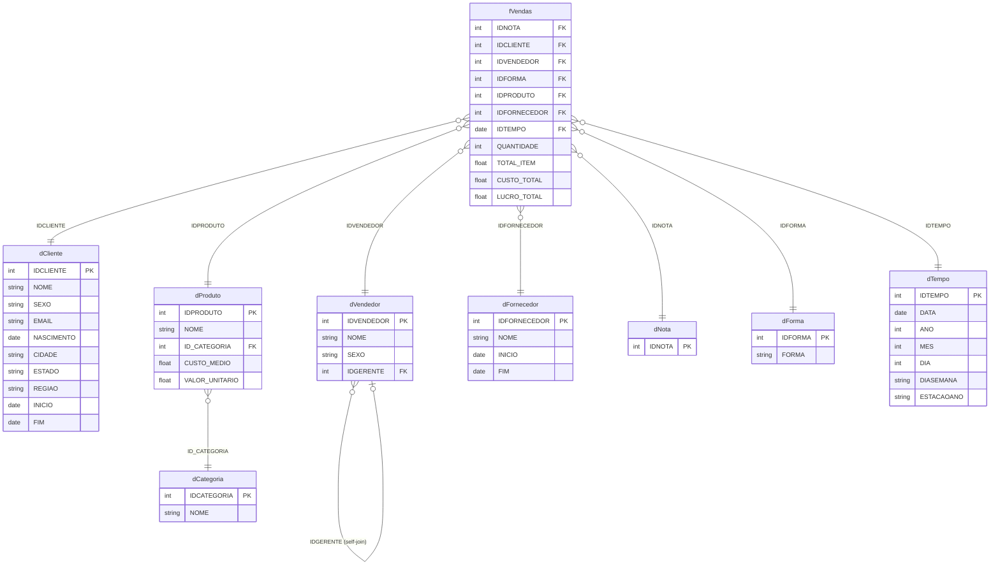

# DOCUMENTAÇÃO – REGISTRO DOS PROCESSOS

**Título:** Análise de Vendas | IA Vendas

**Disciplina:** Análise Exploratória de Dados

**Integrantes do Grupo:**
- Daniel
- Renato
- Ricardo
- Gabriel
- Felipe
- Matheus

---

## Objetivo

Este projeto visa a criação de um Dashboard para analisar o cenário das vendas realizadas do comércio **IA Vendas**. O projeto fornecerá insights sobre as vendas realizadas, vendedores com maior volume de vendas, fornecedores, produtos mais vendidos e outras métricas relevantes.

Com isso, é esperado que o grupo obtenha compreensão e vivência prática de Análise Exploratória de Dados e da construção de relatórios e dashboards através da ferramenta de visualização gráfica Power BI.

---

## INTRODUÇÃO

Este documento descreve os processos envolvidos na construção de um Dashboard em Power BI para o comércio IA Vendas, detalhando desde a configuração do ambiente de versionamento e exploração dos dados até a publicação e apresentação do dashboard ao público-alvo.

O projeto foi desenvolvido pelo Grupo 4 da disciplina de Análise Exploratória de Dados da Biopark Edu, utilizando um conjunto de dados composto por 8 tabelas (1 tabela fato e 7 dimensões) com aproximadamente 35.762 registros de vendas.

Para garantir organização, rastreabilidade e colaboração entre os membros, o projeto adotou controle de versão com **Git e GitHub**, estratégia de branches com `main`, `develop` e `feature/*`, além de uma esteira de CI/CD com **GitHub Actions** para validação automática de PRs e notificações no Discord.

---

## OBJETIVOS DO PROJETO

- Realizar Análise Exploratória de Dados sobre o cenário de vendas do comércio IA Vendas
- Responder perguntas de negócio: melhores clientes, vendedores, produtos, fornecedores e regiões
- Utilizar técnicas de limpeza e normalização de dados com Power Query
- Modelar os dados em esquema Snowflake no Power BI
- Desenvolver um dashboard interativo no Power BI para visualização e análise dos dados
- Publicar e apresentar o dashboard aos stakeholders

---

## 1. EXPLORAÇÃO DOS DADOS DISPONÍVEIS

### 1.1. Exploração dos Dados

**Objetivo:** Compreender a estrutura, tabelas, colunas e tipos de dados existentes nos arquivos disponíveis.

**Atividades:**
- Identificação das 8 tabelas e suas relações
- Revisão dos dados para identificar problemas de qualidade e necessidades de limpeza
- Mapeamento da hierarquia de vendedores (gerentes e subordinados)
- Identificação de colunas SCD (Slowly Changing Dimensions) com campos `INICIO` e `FIM`

**Ferramentas Utilizadas:**
- Power Query
- M Language
- Power BI Desktop

**Tabelas identificadas:**

| Arquivo | Tipo | Registros | Descrição |
|---|---|---|---|
| `fVendas.xlsx` | Fato | 35.762 | Itens de venda com receita, custo e lucro pré-calculados |
| `dCliente.xlsx` | Dimensão | 1.002 | Clientes com cidade, estado e região (SCD tipo 2) |
| `dProduto.xlsx` | Dimensão | 234 | Produtos com custo médio e valor unitário |
| `dVendedor.xlsx` | Dimensão | 24 | Vendedores com hierarquia de gerentes (self-join) |
| `dFornecedor.xlsx` | Dimensão | 42 | Fornecedores (SCD tipo 2) |
| `dNota.xlsx` | Dimensão | 25.400 | Notas fiscais |
| `dForma.xlsx` | Dimensão | 26 | Formas de pagamento |
| `dCategoria.xlsx` | Dimensão | 9 | Categorias de produtos |
| `dTempo` | Dimensão | — | Calendário (chave `IDTEMPO`): data, ano, mês, dia, dia da semana e estação do ano |

> **Nota (22/06/2026):** `dTempo` foi **reincorporada ao modelo**. A dimensão havia sido removida por orientação inicial do professor (sob o entendimento de que pertenceria a outro projeto), mas sua ausência inviabilizava a análise temporal — central para um dashboard de vendas (série histórica de receita, sazonalidade, mapa de calor por dia). Decidiu-se restaurá-la. Ver registro detalhado na seção 2.1.

**Problemas identificados:**
- `dCliente`, `dVendedor` e `dFornecedor` possuem colunas `INICIO` e `FIM` (SCD tipo 2) — filtrar apenas registros com `FIM = null` para obter o registro atual
- `dVendedor` possui self-join via coluna `IDGERENTE` com 3 gerentes (IDs 1, 10 e 16)

---

### 1.2. Medidas

**Descrição:** Medidas DAX criadas para análise exploratória dos dados.

**Ferramentas Utilizadas:**
- Power BI Desktop
- DAX (Data Analysis Expressions)

```dax
Total Receita = SUM(fVendas[TOTAL_ITEM])
```

```dax
Total Custo = SUM(fVendas[CUSTO_TOTAL])
```

```dax
Lucro Bruto = SUM(fVendas[LUCRO_TOTAL])
```

```dax
Margem % = DIVIDE([Lucro Bruto], [Total Receita], 0)
```

```dax
Total Quantidade = SUM(fVendas[QUANTIDADE])
```

---

## MODELAGEM DIMENSIONAL DE DADOS

**Tipo de modelo:** Snowflake Schema

O modelo foi estruturado com `fVendas` no centro, conectada às 8 dimensões. A diferença em relação ao Star Schema está na sub-dimensão: `dProduto` se liga a `dCategoria`, formando um nível adicional de granularidade. `dVendedor` possui auto-relacionamento via `IDGERENTE` para representar a hierarquia gerente → vendedor.

> **Nota (22/06/2026):** `dTempo` foi **reincorporada ao modelo** com relacionamento ativo `fVendas[IDTEMPO] → dTempo[IDTEMPO]` (N:1), habilitando a análise temporal. Os valores de `IDTEMPO` (anos 2101–2104 na origem, por erro de digitação) foram corrigidos para 2011–2014. Isso reverte a remoção registrada anteriormente na seção 2.1.

**Relacionamentos:**

| Tabela Origem | Chave | Tabela Destino | Cardinalidade |
|---|---|---|---|
| fVendas | IDCLIENTE | dCliente | N:1 |
| fVendas | IDVENDEDOR | dVendedor | N:1 |
| fVendas | IDPRODUTO | dProduto | N:1 |
| fVendas | IDFORNECEDOR | dFornecedor | N:1 |
| fVendas | IDNOTA | dNota | N:1 |
| fVendas | IDFORMA | dForma | N:1 |
| fVendas | IDTEMPO | dTempo | N:1 |
| dProduto | ID_CATEGORIA | dCategoria | N:1 |
| dVendedor | IDGERENTE | dVendedor | N:1 (self-join) |

**MER/DER do Modelo**

---

## 2. CONSTRUÇÃO DO DASHBOARD

### 2.1. Importação dos Dados

**Responsável:** Renato

*10/06/2026*
- Carregado os 9 arquivos .xlsx no Power BI
    - dCategoria
    - dCliente
    - dForma
    - dFornecedor
    - dNota
    - dTempo
    - dProduto
    - dVendedor
    - fVendas
- Ajustado as tipagens das colunas (e.g, colunas de ID que vieram como texto foram trocadas para números inteiros)
- Verificado pelas colunas **FIM** para que não sejam incluídas as entradas com valores não-nulos

*11/06/2026*
- Alterado as datas da coluna **IDTEMPO** em fVendas
    - As datas originalmente estavam datadas com anos de 2101 - 2104, então assumimos que houve um erro de digitação e que as datas deveriam ser dos anos 2011 - 2014
    - Convertemos elas para seu formato numérico (inteiro que representa a diferença de dias entre a data atual e janeiro de 1900) e então subtraímos a quantia de dias para subtrair exatamente 90 anos (considerando os 21 dias adicionais provindos de anos bissextos)
- Tratadas as duplicatas
    - Na tabela dProduto, haviam 2 entradas diferentes com IDs iguais. Para tratá-la, apenas alteramos manualmente o ID da entrada cuja coluna **INICIO** tinha o maior valor
    - Todas as outras duplicatas eram entradas com exatamente os mesmos valores, e portanto, foram excluídas
- Não foram encontrados valores nulos nas tabelas (com exceção das colunas **FIM**)
- Ajustado o relacionamento entre tabelas para seguir o modelo SnowFlake

*17/06/2026*
- Removida a tabela `dTempo` do modelo a orientação do professor — o arquivo `dTempo.xlsx` pertence a outro projeto e não deve ser utilizado no IA Vendas
- Desfeito o tratamento das datas da coluna **IDTEMPO** em `fVendas`, retornando aos valores originais
- O relacionamento `fVendas → dTempo` foi removido; a coluna `IDTEMPO` permanece em `fVendas` mas sem vínculo ativo no modelo

*22/06/2026*
- **Reincorporada a dimensão `dTempo`** ao modelo, revertendo a remoção de 17/06. Justificativa: a ausência de uma dimensão de tempo inviabilizava a análise temporal de vendas (série histórica de receita, sazonalidade, mapa de calor por dia), que é central ao objetivo do dashboard.
- **Tratamento dos outliers de data** na coluna **IDTEMPO**: os registros com anos 2101–2104 (erro de digitação na origem) foram corrigidos para 2011–2014 aplicando `Date.AddYears(_, -90)` às datas com ano > 2100 (o `Date.AddYears` já ajusta automaticamente os anos bissextos).
- Reativado o relacionamento `fVendas[IDTEMPO] → dTempo` (N:1).
- Desativada a **Detecção automática de data/hora** do Power BI para eliminar as tabelas de data redundantes geradas automaticamente (que inflavam o modelo e causavam instabilidade no carregamento).

---

### 2.2. Construção do Dashboard no Power BI

> _[Gabriel, Felipe e Matheus — descrever a construção de cada relatório]_

---

### 2.3. Medidas

# Atualização — 11 de junho de 2026

**Responsável:** Daniel (Tech Lead)

---

## Modelagem Snowflake

- Revisão e correção dos relacionamentos no Power BI
- Corrigido relacionamento `fVendas (IDNOTA) → dNota (IDNOTA)` que estava com direção invertida
- Confirmados 7 relacionamentos ativos com cardinalidade `*:1`
- `dTempo` removida do modelo a orientação do professor (ver seção 2.1)

**Relacionamentos finalizados:**

| De | Chave | Para | Cardinalidade |
|---|---|---|---|
| fVendas | IDCLIENTE | dCliente | *:1 |
| fVendas | IDFORMA | dForma | *:1 |
| fVendas | IDFORNECEDOR | dFornecedor | *:1 |
| fVendas | IDNOTA | dNota | *:1 |
| fVendas | IDPRODUTO | dProduto | *:1 |
| fVendas | IDVENDEDOR | dVendedor | *:1 |
| dProduto | ID_CATEGORIA | dCategoria | *:1 |

---

## Medidas DAX

Criação das medidas base na tabela `_Medidas`:

```dax
Total Receita = SUM(fVendas[TOTAL_ITEM])
```

```dax
Total Custo = SUM(fVendas[CUSTO_TOTAL])
```

```dax
Lucro Bruto = SUM(fVendas[LUCRO_TOTAL])
```

```dax
Margem % = DIVIDE([Lucro Bruto], [Total Receita], 0)
```

```dax
Total Quantidade = SUM(fVendas[QUANTIDADE])
```

```dax
Rank Vendedor = RANKX(ALL(dVendedor[NOME]), [Total Receita], , DESC, DENSE)
```

---

## Organização

- Criada tabela `_Medidas` separada das dimensões
- Todas as medidas movidas de `dCategoria` para `_Medidas`
- Convenção: prefixo `_` garante que a tabela aparece no topo do painel de campos

---

## GitHub

- Commit `feat: adiciona tabela _Medidas e medidas DAX base` na `main`
- `develop` sincronizada com a `main`
- Arquivo `_Medidas.tmdl` criado em `powerbi/ia-vendas.SemanticModel/definition/tables/`

```dax
-- Exemplo:
Soma = SUM(tabela[coluna])
```

---

# Atualização — 22 de junho de 2026

**Responsável:** Daniel (Tech Lead)

## Integração do front-end com os dados — dificuldades e decisões

Esta seção registra o processo de unir o design visual (criado em HTML) com os dados reais do Power BI, incluindo os obstáculos enfrentados e as decisões técnicas tomadas.

### Contexto

O grupo havia produzido um conjunto de telas em HTML (pasta `web/`) com um design próprio e bem acabado para os dashboards (sidebar, cabeçalho, cards de KPI, gráficos). A intenção inicial era usar esses HTMLs como camada visual e **plotar os dados reais por cima**, mantendo o design customizado.

### Descoberta: não dá para plotar os dados diretamente nos HTMLs

Ao investigar os arquivos da pasta `web/site/`, descobrimos que **não era viável plotar os dados reais diretamente neles**, pelos seguintes motivos:

- **Os HTMLs são *bundles* compilados (Framer):** cada página tem ~650 KB, com todo o conteúdo (HTML, CSS, fontes) comprimido em *gzip* e embutido em blocos `<script type="__bundler/manifest">`. O design é renderizado em tempo de execução por JavaScript, e os dados exibidos estavam **fixos no código (*hard-coded*)** — não havia ponto de entrada para injetar dados dinâmicos.
- **O *bundler* recria o DOM ao carregar**, o que descartava qualquer elemento injetado manualmente (ex.: um `<iframe>`), inviabilizando sobrepor conteúdo externo.
- Uma tentativa de reescrever as telas em **Vega-Lite carregando os `.xlsx` via SheetJS** no navegador funcionou tecnicamente, mas exigia servidor local e duplicava a lógica de modelagem que já existe no Power BI — sem ganho real.

### Decisão: construir os visuais no próprio Power BI com Deneb

Diante disso, decidimos **inverter a abordagem**: em vez de plotar dados sobre o HTML, **reconstruímos o design dentro do Power BI**, para depois publicar e embedar o relatório no site via `iframe`. Assim o dado é 100% Power BI (interativo, filtrável, atualizável) e o visual mantém a identidade do design do grupo.

Ferramentas e padrões adotados:

- **Deneb** (visual customizado de Vega-Lite) para os gráficos com aparência idêntica ao design. Os *specs* ficam versionados em `powerbi/deneb-specs/`.
- **HTML Content** (visual customizado) para elementos que o Deneb não cobre bem — sidebar, cards de KPI e a tabela de Top Clientes — alimentados por medidas DAX que geram o HTML.

### Dificuldades técnicas encontradas e como resolvemos

- **Codificação de arquivos (UTF-16/BOM):** no Windows, alguns arquivos eram salvos em UTF-16 ou com BOM, quebrando a renderização (README no GitHub, acentos nos `.tmdl`). Padronizamos a gravação em **UTF-8 sem BOM**.
- **Deneb: *spec* × *template*:** o Deneb diferencia o *spec* puro (Vega-Lite) do *template* (com metadados `usermeta`). Colar o *spec* pela opção *Import* gerava erro "not a valid Deneb template"; o caminho correto é colar no editor de **Specification**.
- **Vínculo de dados no Deneb:** o *data role* do Deneb chama-se `dataset`; os *specs* usam `"data": { "name": "dataset" }`.
- **KPIs com tendência ("vs mês anterior"):** o card nativo do Power BI não exibe ícone + variação. Resolvido com **HTML Content + medidas de *time-intelligence*** (`DATEADD(dTempo[DATA], -1, MONTH)`), que só calculam a variação quando exatamente um mês está selecionado — daí a necessidade do **slicer de Mês/Ano** no topo da página.
- **Layout para embed:** removemos a sidebar interna do relatório (redundante com a navegação do site) e estendemos a página (modo *FitToWidth*) para o relatório rolar como uma página de site dentro do `iframe`.

### Estado atual

- Página **Visão Geral** reconstruída: slicers, 4 cards de KPI com tendência, e 6 visuais (Receita ao longo do tempo, Vendas por região, Ranking de vendedores, Top clientes, Mapa de calor, Destaques).
- Pendências: o cross-filter por clique, o ajuste dos filtros e a entrega da página seguem na atualização de 23/06.

---

# Atualização — 23 de junho de 2026

**Responsável:** Daniel (Tech Lead)

## Entrega da primeira página (Visão Geral) — desafios superados

Hoje finalizei e **entreguei a primeira página do dashboard — a Visão Geral** — já com a aparência fiel ao design do grupo e com os dados reais do Power BI. O caminho até aqui teve vários desafios técnicos que vale registrar:

### Reconstrução fiel dos visuais

Refiz cada visual da Visão Geral espelhando o design de referência (a tela "Conservador"):

- **Cards de KPI** com ícone, valor e variação **"% vs mês anterior"** (seta verde/vermelha), via HTML Content + medidas de *time-intelligence*.
- **Receita ao longo do tempo**: ajustei para mostrar os **últimos 12 meses (móvel)**, com pontos em cada mês; recalcula sozinho conforme o filtro.
- **Vendas por região**: comecei como um mosaico de tamanho fixo (que eu havia *hard-coded*), mas percebi que o ideal era um **treemap de verdade** — onde o tamanho de cada região é proporcional à receita. Refiz em **Vega** (o Vega-Lite não tem treemap nativo), eliminando o *hard-code* de posição.
- **Top Clientes**: troquei o gráfico de barras por uma **tabela** (rank, região, pedidos, receita, status), idêntica ao design, gerada por DAX (`TOPN` + `CONCATENATEX`).
- **Ranking de Vendedores** (Top 6), **Mapa de Calor** (dia × mês, com *tooltip*) e **Destaques**.

### Filtros no estilo do design

Reorganizei a experiência de filtros para ficar fiel ao original e mais limpa:

- Mantive apenas os **filtros de Mês e Ano** no topo, como *pills* (dropdown estilizado).
- Os demais filtros viraram **filtro cruzado por clique** (*cross-filter*): clicar no Ranking (vendedor), no Mapa de Calor (dia/mês) ou na Receita (mês) filtra a página inteira. Filtros de Categoria e Pagamento passam a viver nas páginas de Produtos e Vendas, respectivamente, onde fazem mais sentido.

### Dificuldades técnicas (e limitações honestas)

- **Cross-filter no Deneb:** funciona bem nos visuais **Vega-Lite** (Ranking, Mapa, Receita). Para o **treemap (Vega)**, o filtro por clique **não funcionou** — a identidade do registro não sobrevive ao *transform* do treemap. Decidimos manter o treemap apenas como visualização (sem clique), para não atrasar a entrega.
- **Limitação do HTML Content:** os cards de KPI e a tabela de Top Clientes são visuais de exibição e **não suportam** filtro cruzado.
- **Erro de carregamento do projeto (TMDL):** ao remover uma medida, uma quebra de indentação (um *tab* perdido em `_Medidas.tmdl`) fez o Power BI recusar abrir o projeto inteiro. Identificamos e corrigimos a indentação; o `.pbip` voltou a abrir normalmente.

### Resultado

A **Visão Geral está entregue e funcional** — design fiel, dados reais, KPIs com tendência, filtros por Mês/Ano e interatividade por clique nos gráficos. As demais páginas (Clientes, Produtos, Fornecedores, Regiões, Vendas) seguem o mesmo padrão e serão construídas na sequência. Itens opcionais como modais "ver todos" e painel de filtros flutuante ficam como evolução futura.

---

# Atualização — 23 de junho de 2026 (conclusão das 6 páginas)

**Responsável:** Daniel (Tech Lead)

## Construção das demais páginas — dashboard completo

Após a Visão Geral, repliquei o mesmo padrão (Deneb + HTML Content, *pills* de Mês/Ano no topo e filtro cruzado por clique) nas outras cinco páginas. O dashboard ficou **completo, com 8 páginas no total** (6 principais + 2 de detalhe).

### Padrão técnico adotado em todas as páginas

- **KPIs**: visuais **HTML Content** alimentados por medidas DAX que geram o HTML (ícone SVG + valor + descritor/tendência).
- **Gráficos**: **Deneb** (Vega-Lite/Vega), com *specs* versionados em `powerbi/deneb-specs/`.
- **Tabelas**: HTML Content geradas por DAX (`SUMMARIZE`/`TOPN`/`CONCATENATEX`), com cabeçalho fixo e rolagem interna.
- **Filtros**: *slicers* nativos em modo *dropdown* estilizados como *pills*; o restante via **filtro cruzado** (clique nos gráficos Deneb).
- **Layout**: páginas em modo *FitToWidth* para rolarem como página de site dentro do `iframe`.
- A **barra lateral** interna e os botões de navegação foram removidos de todas as páginas — a navegação será feita por **links do HTML** no momento do *embed*.

### Página Clientes

- **KPIs**: Total Clientes, Clientes Ativos, Clientes Únicos, Ticket Médio.
- **Gráficos**: Clientes por Região (barras, com %), Distribuição por Sexo (rosca roxo/rosa, com %), Top Clientes (tabela).
- **Página de detalhe "Todos os Clientes"**: tabela com os 1.002 clientes no mesmo design, com **filtro de ordenação** (Receita/Nome/Pedidos/Ticket) e **busca**.

### Página Produtos

- **KPIs**: Total Produtos, Categorias, Margem Média, Qtd. Total Vendida.
- **Gráficos**: Top Produtos por Receita (barras Top 8), Mix por Categoria (rosca com legenda valor·%), Catálogo (Top 8 com **margem em *badge* colorido** por faixa).
- **Página de detalhe "Todos os Produtos"**: catálogo completo (234 itens) com ordenação e busca.

### Página Fornecedores

- **KPIs**: Total Fornecedores, Ativos, Inativos, Produtos Fornecidos.
- **Gráficos**: Top Fornecedores por Custo (barras), Fornecedores por Categoria (barras), Cadastro de Fornecedores (tabela com datas de contrato Início/Fim e *badge* de status Ativo/Inativo).

### Página Regiões

- **Mapa do Brasil** (visual **Azure Map**): estilo escuro, **bolhas por estado** dimensionadas pela receita e **coloridas por região**; *tooltip* com Receita, Clientes e Pedidos.
- Para o *geocoding*, criei a coluna calculada `dCliente[Estado Nome]` (sigla → nome completo), marcada como geográfica.
- **Cards de região** (Deneb, clicáveis) com cor fixa por região: Norte (verde), Nordeste (laranja), Centro-Oeste (ciano), Sudeste (roxo), Sul (lilás) — clicar filtra a página.
- **Tabela de Estados** (27 UFs) com Estado, Capital (mapeada por DAX), Região, Clientes, Pedidos, Receita.

### Página Vendas

- **KPIs**: Total de Notas, Receita Total (com tendência), Lucro Total (com margem), Custo Total.
- **Gráficos**: Receita por Mês (barras Jan→Dez), Forma de Pagamento (rosca Top 5 com legenda valor·%), Vendas Recentes (tabela transacional das últimas 30 vendas: Nota, Data, Cliente, Vendedor, Categoria, Pagamento, Qtd, Total, Lucro, Status).

### Novas medidas e objetos do modelo

- Dezenas de medidas DAX adicionadas em `_Medidas` (contagens, cartões HTML, tabelas HTML, *time-intelligence* de tendência).
- Tabelas desconectadas `Ordenar Clientes` e `Ordenar Produtos` (parâmetros para a ordenação dinâmica das tabelas de detalhe).
- Coluna calculada `dCliente[Estado Nome]` para o mapa.

### Dificuldade adicional registrada

- Durante a remoção de uma medida, uma quebra de indentação por *tab* em `_Medidas.tmdl` deixou um objeto na coluna 0 e o Power BI recusou abrir o projeto inteiro (erro `UnsupportedObjectType`). Corrigido recolocando o *tab*; passamos a validar a indentação após cada edição do modelo.

### Resultado

**Dashboard 100% construído** — 6 páginas principais (Visão Geral, Clientes, Produtos, Fornecedores, Regiões, Vendas) + 2 de detalhe (Todos os Clientes, Todos os Produtos), fiéis ao design e com dados reais. **Próximo passo: publicação no Power BI Service / Fabric e *embed* de cada página no site.**

---

# Atualização — 23 de junho de 2026 (responsividade e layout mobile)

**Responsável:** Daniel (Tech Lead)

## Adaptação para celular — site responsivo + páginas mobile no Power BI

Com o dashboard completo e publicado, ataquei a última frente: deixar a experiência **usável no celular**. Esse trabalho tem duas camadas independentes, e entender a diferença entre elas foi metade da batalha.

### Camada 1 — Responsividade do site (HTML)

As páginas em `web/site/` (o *shell* que embeda o Power BI via `iframe`) usavam uma **sidebar lateral que expandia no *hover***. Problema: *hover* não existe em toque, então no celular a navegação ficava inutilizável.

Adicionei um bloco `@media (max-width:768px)` em todas as 7 páginas do dashboard, reaproveitando as mesmas variáveis e o mesmo *glass blur* do tema (não recriei nada):

- A sidebar **vira uma barra inferior horizontal**, acionada por toque (sem depender de *hover*).
- A barra **flutua por cima do `iframe` com o efeito *glass blur*** (`backdrop-filter`), igual à sidebar expandida no desktop — o frame ocupa a tela inteira e a barra fica sobreposta.
- *Topbar* compacta, *breadcrumb* oculto e margens reduzidas.
- Acima de 768px tudo volta ao layout desktop automaticamente. É 100% CSS, sem JS.

### Descoberta: o *embed* "publish to web" ignora o layout de celular do Power BI

Aqui caí numa armadilha que vale registrar. Montei o **Layout para celular** no Power BI Desktop (a visão de telefone, que gera os arquivos `mobile.json` por visual) achando que isso resolveria. Ao testar no site, **o `iframe` continuava mostrando o canvas desktop encolhido**, com um grande espaço morto embaixo.

Motivo: **o *embed* "publish to web" sempre renderiza o canvas desktop.** O layout de telefone que montamos só aparece no **app do Power BI / no Service quando detecta um celular** — nunca no `iframe` público. Ou seja, todo o trabalho de "Layout para celular" não tem efeito no site.

### Decisão: páginas dedicadas em canvas retrato

Para o `iframe` realmente ficar vertical no celular, a saída é ter **páginas cujo canvas já nasce em formato retrato**. Como mudar o canvas das páginas existentes quebraria o desktop, **dupliquei as páginas do menu em versões mobile** (`pg...Mobile`), com canvas estreito (**324 px de largura**, `FitToWidth`, rolando na vertical). Reaproveitei as posições que eu já tinha desenhado no Layout para celular (os `mobile.json`) como base das posições empilhadas dessas páginas.

Páginas mobile criadas:

| Página mobile | Canvas (L×A) | Visuais | Observação |
|---|---|---|---|
| `pgVisaoGeralMobile` | 324×2021 | 11 | sem o Deneb `v4` (removido de propósito) |
| `pgClientesMobile` | 324×1740 | 11 | — |
| `pgProdutosMobile` | 325×1669 | 11 | — |
| `pgFornecedoresMobile` | 325×1490 | 9 | — |
| `pgRegioesMobile` | 324×1772 | 4 | sem o **Azure Map** (não rende bem em telefone) |
| `pgVendasMobile` | 325×1829 | 11 | — |

A página de **Abertura** ficou de fora do mobile intencionalmente; o relatório abre direto na Visão Geral (`activePageName`), então isso não afeta a navegação.

### *Specs* Deneb em versão mobile

Versionei variantes mobile de todos os gráficos Deneb em `powerbi/deneb/mobile/` (mesmos *binds* e tema, ajustados para *tile* estreito): título menor sem subtítulo, eixos compactos sem rótulo de eixo, Top N reduzido (10→6, 15→8), *donuts* com legenda embaixo e barras antes rotacionadas viradas horizontais. Documentação em `powerbi/deneb/mobile/README.md`.

### Dificuldade técnica — o BOM que travou o projeto (UTF-8)

As páginas mobile foram geradas por *script* (copiar a página, trocar o bloco `position` de cada `visual.json` pela posição do `mobile.json`, ajustar o `page.json` e o `pages.json`). Na primeira tentativa, o Power BI recusou abrir o projeto com **erro de UTF-8**.

Causa: o `Set-Content` do PowerShell 5.1 grava arquivos **com BOM** (marca de ordem de bytes no início). O formato **PBIR exige UTF-8 *sem* BOM**, e como eu também havia regravado o `pages.json` (lido logo na abertura), o BOM ali derrubava o relatório inteiro. Reescrevi tudo usando `.NET WriteAllText` com `UTF8Encoding($false)` (sem BOM) e validei byte a byte. Reforça a padronização de **UTF-8 sem BOM** já registrada na atualização de 22/06.

### Próximo passo

- **Republicar no Fabric** com as 6 páginas mobile.
- No HTML, adicionar um JS que troca o `pageName` do `iframe` para a versão `...Mobile` quando a tela é ≤768px — assim o `iframe` passa a exibir o canvas retrato de verdade, sem espaço morto. O *embed* só reconhece as páginas mobile **após** a republicação.

### Resultado

Site responsivo (barra inferior *glass*, automática) + 6 páginas mobile em canvas retrato no relatório + *specs* Deneb mobile versionados. Falta apenas republicar e fazer a troca do `pageName` no `iframe` para fechar a experiência mobile ponta a ponta.

---

### 2.4. Design e Desenvolvimento

> _[Descrever as visualizações criadas e as decisões de design]_

> 📸 _[Inserir prints dos dashboards finalizados]_

---

### 2.5. Validação das Visualizações

> _[Descrever como foram validadas as visualizações e os dados]_

---

### 2.6. Publicação do Dashboard no Power BI Service

#### 2.7. Publicação

> _[Descrever o processo de publicação no Power BI Service / Fabric]_

> 📸 _[Inserir print da publicação]_

#### 2.8. Compartilhamento

> _[Descrever como o dashboard foi compartilhado]_

---

### 2.9. Apresentação do Dashboard ao Público-Alvo

#### 2.10. Preparação da Apresentação

> _[Descrever como a apresentação foi preparada]_

#### 2.11. Demonstração

> _[Descrever os principais insights apresentados]_

> 📸 _[Inserir prints da apresentação final]_

---

## Repositório

[https://github.com/JISAE221/projeto-ia-vendas](https://github.com/JISAE221/projeto-ia-vendas)

---

*Disciplina: Análise Exploratória de Dados — Biopark Edu · Grupo 4*