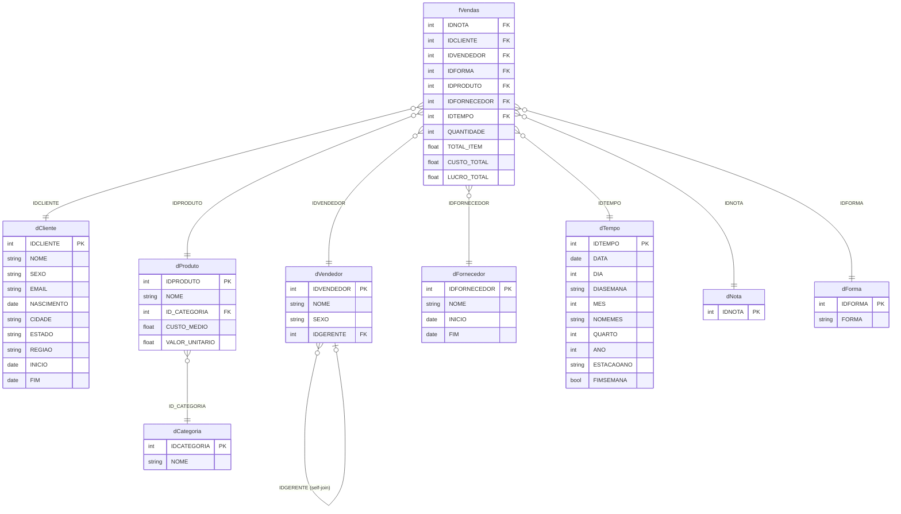

# DOCUMENTAÇÃO – REGISTRO DOS PROCESSOS

**Título:** Análise de Vendas | IA Vendas

**Disciplina:** Análise Exploratória de Dados

**Integrantes do Grupo:**
- Daniel
- Renato
- Ricardo
- Gabriel
- Felipe
- Matheus

---

## Objetivo

Este projeto visa a criação de um Dashboard para analisar o cenário das vendas realizadas do comércio **IA Vendas**. O projeto fornecerá insights sobre as vendas realizadas, vendedores com maior volume de vendas, fornecedores, produtos mais vendidos e outras métricas relevantes.

Com isso, é esperado que o grupo obtenha compreensão e vivência prática de Análise Exploratória de Dados e da construção de relatórios e dashboards através da ferramenta de visualização gráfica Power BI.

---

## INTRODUÇÃO

Este documento descreve os processos envolvidos na construção de um Dashboard em Power BI para o comércio IA Vendas, detalhando desde a configuração do ambiente de versionamento e exploração dos dados até a publicação e apresentação do dashboard ao público-alvo.

O projeto foi desenvolvido pelo Grupo 4 da disciplina de Análise Exploratória de Dados da Biopark Edu, utilizando um conjunto de dados composto por 9 tabelas (1 tabela fato e 8 dimensões) com aproximadamente 35.762 registros de vendas.

Para garantir organização, rastreabilidade e colaboração entre os membros, o projeto adotou controle de versão com **Git e GitHub**, estratégia de branches com `main`, `develop` e `feature/*`, além de uma esteira de CI/CD com **GitHub Actions** para validação automática de PRs e notificações no Discord.

---

## OBJETIVOS DO PROJETO

- Realizar Análise Exploratória de Dados sobre o cenário de vendas do comércio IA Vendas
- Responder perguntas de negócio: melhores clientes, vendedores, produtos, fornecedores e regiões
- Utilizar técnicas de limpeza e normalização de dados com Power Query
- Modelar os dados em esquema Snowflake no Power BI
- Desenvolver um dashboard interativo no Power BI para visualização e análise dos dados
- Publicar e apresentar o dashboard aos stakeholders

---

## 1. EXPLORAÇÃO DOS DADOS DISPONÍVEIS

### 1.1. Exploração dos Dados

**Objetivo:** Compreender a estrutura, tabelas, colunas e tipos de dados existentes nos arquivos disponíveis.

**Atividades:**
- Identificação das 9 tabelas e suas relações
- Revisão dos dados para identificar problemas de qualidade e necessidades de limpeza
- Mapeamento da hierarquia de vendedores (gerentes e subordinados)
- Identificação de colunas SCD (Slowly Changing Dimensions) com campos `INICIO` e `FIM`

**Ferramentas Utilizadas:**
- Power Query
- M Language
- Power BI Desktop

**Tabelas identificadas:**

| Arquivo | Tipo | Registros | Descrição |
|---|---|---|---|
| `fVendas.xlsx` | Fato | 35.762 | Itens de venda com receita, custo e lucro pré-calculados |
| `dTempo.xlsx` | Dimensão | 36.525 | Calendário completo 1950–2049 |
| `dCliente.xlsx` | Dimensão | 1.002 | Clientes com cidade, estado e região (SCD tipo 2) |
| `dProduto.xlsx` | Dimensão | 234 | Produtos com custo médio e valor unitário |
| `dVendedor.xlsx` | Dimensão | 24 | Vendedores com hierarquia de gerentes (self-join) |
| `dFornecedor.xlsx` | Dimensão | 42 | Fornecedores (SCD tipo 2) |
| `dNota.xlsx` | Dimensão | 25.400 | Notas fiscais |
| `dForma.xlsx` | Dimensão | 26 | Formas de pagamento |
| `dCategoria.xlsx` | Dimensão | 9 | Categorias de produtos |

**Problemas identificados:**
- `dCliente`, `dVendedor` e `dFornecedor` possuem colunas `INICIO` e `FIM` (SCD tipo 2) — filtrar apenas registros com `FIM = null` para obter o registro atual
- Alguns registros de `fVendas` apresentam `IDTEMPO` com ano 2102 — provável erro de importação a ser corrigido no Power Query
- `dVendedor` possui self-join via coluna `IDGERENTE` com 3 gerentes (IDs 1, 10 e 16)

---

### 1.2. Medidas

**Descrição:** Medidas DAX criadas para análise exploratória dos dados.

**Ferramentas Utilizadas:**
- Power BI Desktop
- DAX (Data Analysis Expressions)

```dax
Total Receita = SUM(fVendas[TOTAL_ITEM])
```

```dax
Total Custo = SUM(fVendas[CUSTO_TOTAL])
```

```dax
Lucro Bruto = SUM(fVendas[LUCRO_TOTAL])
```

```dax
Margem % = DIVIDE([Lucro Bruto], [Total Receita], 0)
```

```dax
Total Quantidade = SUM(fVendas[QUANTIDADE])
```

---

## MODELAGEM DIMENSIONAL DE DADOS

**Tipo de modelo:** Snowflake Schema

O modelo foi estruturado com `fVendas` no centro, conectada às 8 dimensões. A diferença em relação ao Star Schema está na sub-dimensão: `dProduto` se liga a `dCategoria`, formando um nível adicional de granularidade. `dVendedor` possui auto-relacionamento via `IDGERENTE` para representar a hierarquia gerente → vendedor.

**Relacionamentos:**

| Tabela Origem | Chave | Tabela Destino | Cardinalidade |
|---|---|---|---|
| fVendas | IDCLIENTE | dCliente | N:1 |
| fVendas | IDVENDEDOR | dVendedor | N:1 |
| fVendas | IDPRODUTO | dProduto | N:1 |
| fVendas | IDFORNECEDOR | dFornecedor | N:1 |
| fVendas | IDTEMPO | dTempo | N:1 |
| fVendas | IDNOTA | dNota | N:1 |
| fVendas | IDFORMA | dForma | N:1 |
| dProduto | ID_CATEGORIA | dCategoria | N:1 |
| dVendedor | IDGERENTE | dVendedor | N:1 (self-join) |

**MER/DER do Modelo**

---

## 2. CONSTRUÇÃO DO DASHBOARD

### 2.1. Importação dos Dados

> _[Renato — descrever o processo de importação e ETL no Power Query]_

---

### 2.2. Construção do Dashboard no Power BI

> _[Gabriel, Felipe e Matheus — descrever a construção de cada relatório]_

---

### 2.3. Medidas

> _[Adicionar as medidas DAX criadas durante a construção do dashboard]_

```dax
-- Exemplo:
Soma = SUM(tabela[coluna])
```

---

### 2.4. Design e Desenvolvimento

> _[Descrever as visualizações criadas e as decisões de design]_

> 📸 _[Inserir prints dos dashboards finalizados]_

---

### 2.5. Validação das Visualizações

> _[Descrever como foram validadas as visualizações e os dados]_

---

### 2.6. Publicação do Dashboard no Power BI Service

#### 2.7. Publicação

> _[Descrever o processo de publicação no Power BI Service / Fabric]_

> 📸 _[Inserir print da publicação]_

#### 2.8. Compartilhamento

> _[Descrever como o dashboard foi compartilhado]_

---

### 2.9. Apresentação do Dashboard ao Público-Alvo

#### 2.10. Preparação da Apresentação

> _[Descrever como a apresentação foi preparada]_

#### 2.11. Demonstração

> _[Descrever os principais insights apresentados]_

> 📸 _[Inserir prints da apresentação final]_

---

## Repositório

[https://github.com/JISAE221/projeto-ia-vendas](https://github.com/JISAE221/projeto-ia-vendas)

---

*Disciplina: Análise Exploratória de Dados — Biopark Edu · Grupo 4*